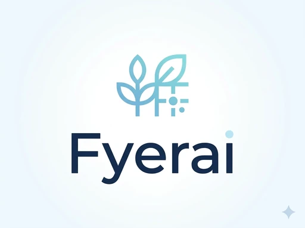

# 🌿 Fyerai - AI-Powered Nutrition Intelligence

[](https://vercel.com/new/clone?repository-url=https://github.com/YOUR_USERNAME/fyerai)

> Instantly decode any food package with AI. Know what you're really eating.



## 🚀 Quick Deploy

### Deploy to Vercel (60 seconds)
1. Fork this repository
2. Go to [vercel.com](https://vercel.com)
3. Click "New Project"
4. Import your forked repository
5. Click "Deploy"
6. ✅ Done! Your site is live

### Deploy to Netlify
1. Fork this repository  
2. Go to [netlify.com](https://netlify.com)
3. Click "Add new site" → "Import an existing project"
4. Connect to GitHub and select your fork
5. Click "Deploy"
6. ✅ Done!

## ✨ Features

- **📸 Instant Analysis** - Upload or snap a photo of any food package
- **🎯 Health Scoring** - Get a 1-10 health rating instantly
- **⚠️ Risk Detection** - Identifies harmful ingredients
- **💡 Smart Insights** - AI-powered health recommendations
- **✨ Better Alternatives** - Suggests healthier options
- **📱 Mobile Camera** - Take photos directly in-app
- **🎨 Premium Design** - Beautiful, modern interface
- **⚡ Lightning Fast** - No backend required
- **💰 100% Free** - No API costs, forever

## 🛠️ Tech Stack

- Pure HTML, CSS, JavaScript
- No build process required
- No dependencies
- 100% static - works anywhere

## 📁 Project Structure

```
fyerai/
├── index.html          # Main application
├── logo.webp           # Fyerai logo
└── README.md          # This file
```

## 💻 Local Development

No build tools needed! Just open `index.html` in your browser.

**Note:** Camera functionality requires HTTPS, so test camera features on deployed version.

## 🎨 Customization

### Change Colors
Edit CSS variables in `index.html`:
```css
:root {
    --primary-start: #6CB4D4;
    --primary-mid: #5BA0C5;
    --primary-end: #4A8CB6;
}
```

### Add Analytics
Add before closing `</head>`:
```html
<script async src="https://www.googletagmanager.com/gtag/js?id=GA_MEASUREMENT_ID"></script>
```

## 🚧 Roadmap

- [ ] Real OCR integration (Google Cloud Vision)
- [ ] LLM-powered analysis (GPT/Gemini)
- [ ] User accounts & history
- [ ] Barcode scanning
- [ ] Mobile app (React Native)
- [ ] Nutrition database
- [ ] Community features

## 💰 Cost

| Service | Cost |
|---------|------|
| Hosting | ₹0 (free tier) |
| API | ₹0 (rule-based) |
| SSL | ₹0 (included) |
| **Total** | **₹0/month** |

## 📄 License

MIT License - Use freely for personal or commercial projects

## 👨‍💻 Author

**Vrishank** - Founder & CEO
- Location: Hyderabad, India
- Age: 17
- Goal: Harvard CS 2027

## 🙏 Acknowledgments

Built with passion for healthier living and informed choices.

---

**Ready to deploy? Click the button above!** 🚀
